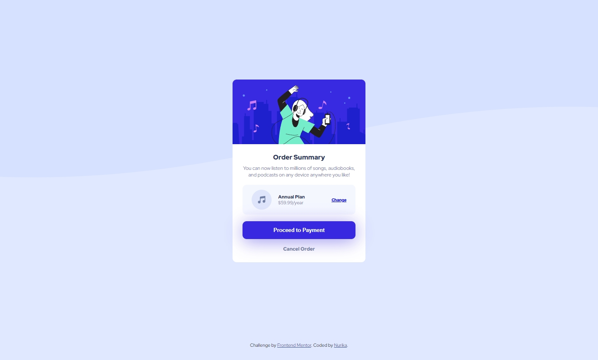
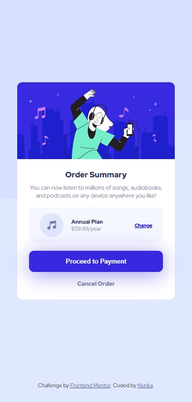

# Frontend Mentor - Order summary card solution

This is a solution to the [Order summary card challenge on Frontend Mentor](https://www.frontendmentor.io/challenges/order-summary-component-QlPmajDUj). Frontend Mentor challenges help you improve your coding skills by building realistic projects. 

## Table of contents

- [Overview](#overview)
  - [The challenge](#the-challenge)
  - [Screenshot](#screenshot)
  - [Links](#links)
- [My process](#my-process)
  - [Built with](#built-with)
  - [What I learned](#what-i-learned)
  - [Continued development](#continued-development)
  - [Useful resources](#useful-resources)
- [Author](#author)

## Overview

Order summary card made using HTML and CSS with CSS Grid.

### The challenge

Users should be able to:

- See hover states for interactive elements

### Screenshot

### Links

- Solution URL: [https://github.com/nunu114/order-summary-component-solution.git](https://github.com/nunu114/order-summary-component-solution.git)
- Live Site URL: [https://order-summary-component-nunu.netlify.app/](https://order-summary-component-nunu.netlify.app/)

## My process

1. Looking through the design example and start planning how to get my solution to look similar to the design
2. Write the structure of the page using HTML
3. Design the page each section from top to bottom in mobile screen size

### Built with

- Semantic HTML5 markup
- CSS custom properties
- Flexbox
- Mobile-first workflow

### What I learned

Getting myself comfortable using flexbox.

### Continued development

Learn more about responsive design.

### Useful resources

- [Background size](https://www.w3schools.com/cssref/css3_pr_background-size.php) - This helped me for setting the background image size.

## Author

- Website - [Nurika](https://github.com/nunu114)
- Frontend Mentor - [@nunu114](https://www.frontendmentor.io/profile/nunu114)

